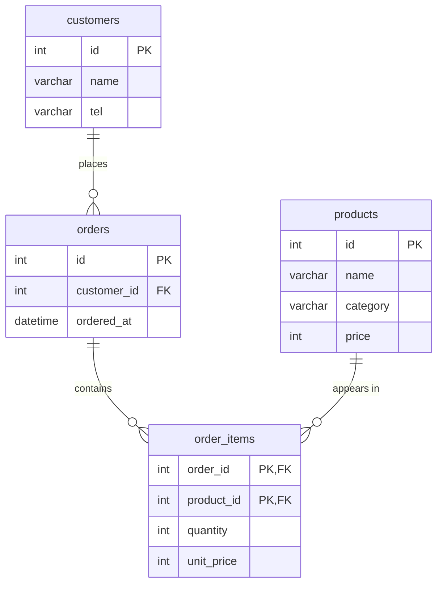

# ERD 설계서

주문/상품 도메인의 데이터 모델 설계서입니다. 고객(customers), 상품(products), 주문(orders), 주문상세(order_items) 4개 엔터티로 구성되며, 주문과 상품 사이의 N:M 관계를 `order_items` 교차 테이블로 해소합니다.

---

## 1. ERD 다이어그램



---

## 2. 엔터티 정의

### 2.1 customers (고객)

주문을 생성하는 주체인 고객 정보를 저장합니다.

| 컬럼 | 타입 | 키 | NULL | 설명 |
|------|------|----|------|------|
| id | int | PK | NOT NULL | 고객 고유 식별자 (자동 증가) |
| name | varchar | | NOT NULL | 고객 이름 |
| tel | varchar | | NULL | 연락처 (전화번호) |

### 2.2 products (상품)

판매 대상 상품의 마스터 정보를 저장합니다.

| 컬럼 | 타입 | 키 | NULL | 설명 |
|------|------|----|------|------|
| id | int | PK | NOT NULL | 상품 고유 식별자 (자동 증가) |
| name | varchar | | NOT NULL | 상품명 |
| category | varchar | | NULL | 상품 분류 |
| price | int | | NOT NULL | 상품 정가(현재 판매가) |

### 2.3 orders (주문)

고객이 생성한 주문의 헤더 정보를 저장합니다.

| 컬럼 | 타입 | 키 | NULL | 설명 |
|------|------|----|------|------|
| id | int | PK | NOT NULL | 주문 고유 식별자 (자동 증가) |
| customer_id | int | FK → customers.id | NOT NULL | 주문한 고객 참조 |
| ordered_at | datetime | | NOT NULL | 주문 일시 |

### 2.4 order_items (주문상세 · 교차 테이블)

주문과 상품의 N:M 관계를 해소하는 교차(연결) 테이블입니다. 한 주문에 담긴 개별 상품 라인을 표현합니다.

| 컬럼 | 타입 | 키 | NULL | 설명 |
|------|------|----|------|------|
| order_id | int | PK, FK → orders.id | NOT NULL | 소속 주문 참조 |
| product_id | int | PK, FK → products.id | NOT NULL | 주문된 상품 참조 |
| quantity | int | | NOT NULL | 주문 수량 |
| unit_price | int | | NOT NULL | 주문 시점의 단가(스냅샷) |

> 복합 기본키 `(order_id, product_id)`로 동일 주문 내 동일 상품의 중복 라인을 방지합니다.

---

## 3. 관계 정의

| 관계명 | 부모 (1) | 자식 (N) | 카디널리티 | 설명 |
|--------|----------|----------|-----------|------|
| places | customers | orders | 1 : N | 한 고객은 여러 주문을 생성할 수 있다. |
| contains | orders | order_items | 1 : N | 한 주문은 여러 주문상세 라인을 포함한다. |
| appears in | products | order_items | 1 : N | 한 상품은 여러 주문상세 라인에 등장할 수 있다. |

### 3.1 N:M 관계 해소

- 논리적으로 **orders ↔ products** 는 다대다(N:M) 관계입니다.
  - 하나의 주문은 여러 상품을 포함할 수 있고,
  - 하나의 상품은 여러 주문에 포함될 수 있습니다.
- 관계형 DB는 N:M 관계를 직접 표현할 수 없으므로, 두 개의 1:N 관계로 분해하기 위해 교차 테이블 `order_items`를 도입합니다.

```
orders (1) ──< order_items >── (1) products
          contains        appears in
```

- `order_items`의 복합 PK `(order_id, product_id)`는 각각 양쪽 부모 테이블에 대한 FK이기도 합니다.

---

## 4. 정규화 근거

### 4.1 제1정규형 (1NF)
- 모든 컬럼이 원자값(atomic)을 가집니다. 주문에 담긴 여러 상품을 한 컬럼에 나열(반복 그룹)하지 않고, `order_items`의 개별 행으로 분리했습니다.

### 4.2 제2정규형 (2NF)
- `order_items`의 복합 PK `(order_id, product_id)`에 대해 부분 함수 종속을 제거했습니다.
  - 고객 정보(name, tel)는 `order_id`가 아닌 `customers`에,
  - 상품 정보(name, category)는 `product_id`가 아닌 `products`에 위치합니다.
  - `quantity`, `unit_price`만 복합키 전체에 완전 함수 종속되어 `order_items`에 남습니다.

### 4.3 제3정규형 (3NF)
- 이행적 종속(transitive dependency)을 제거했습니다.
  - 주문 헤더(`orders`)에 고객의 name/tel을 중복 저장하지 않고 `customer_id` FK로만 참조합니다.
  - 상품 분류/상품명 등은 `products`에만 존재합니다.

결론: 설계는 **제3정규형(3NF)** 을 만족합니다.

---

## 5. 반정규화 결정

| 항목 | 결정 | 근거 |
|------|------|------|
| `order_items.unit_price` | **반정규화 적용** | 상품 가격(`products.price`)은 시간이 지나며 변동됩니다. 주문 시점의 거래 단가를 보존해야 과거 주문의 금액이 재계산되지 않습니다. 따라서 주문 시점 단가를 스냅샷으로 복제 저장합니다. |
| 주문 총액(order total) | **미적용 (정규화 유지)** | `SUM(quantity * unit_price)`로 집계 가능합니다. 조회 성능 이슈가 커지면 추후 `orders.total_amount` 컬럼으로 반정규화를 고려합니다. |
| 고객명/상품명 중복 저장 | **미적용** | 데이터 일관성 유지를 우선합니다. 변경 시 갱신 이상(update anomaly) 위험이 있어 FK 참조로만 관리합니다. |

### 반정규화 트레이드오프 요약
- `unit_price` 복제는 **데이터 무결성(거래 정확성)** 을 위한 의도적 중복이며, 정규화 위반이 아니라 **시점 데이터(historical snapshot)** 로 해석합니다.
- 그 외 계산 가능하거나 일관성 위험이 있는 값은 반정규화하지 않아 저장 공간과 갱신 이상 위험을 최소화합니다.
